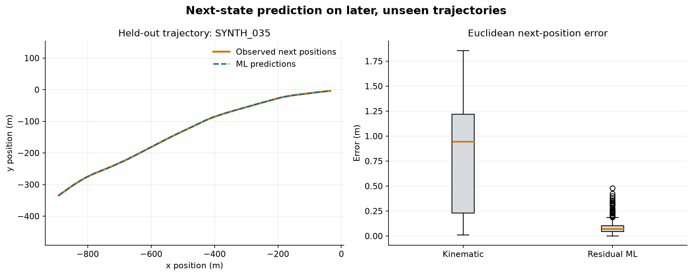
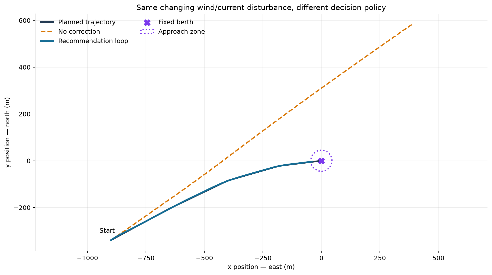

# Maritime Berthing Decision Support

**Trajectory Prediction • Deviation Detection • Closed-Loop Recommendation**

> [!CAUTION]
> This is a deterministic **synthetic simulation and research case study**. It is not certified navigation software, is not safe for controlling a vessel, and does not issue autonomous ship commands. A human pilot or bridge operator retains authority.

## Operational problem

The berth is preassigned. The problem is not *which berth should the vessel use?* It is:

> How can a vessel follow a planned final-approach trajectory while wind, current, motion, and accumulated deviation change over time?

The system repeats a simple feedback loop until the vessel enters the fixed berth's 45 m final approach zone or the simulation timeout is reached:

```text
FIXED BERTH → PLAN → OBSERVE → PREDICT → COMPARE → DETECT DEVIATION
                  ↑                                      ↓
                  └──────── MOVE ← RECOMMEND CORRECTION ─┘
```

| Component | Question |
|---|---|
| Planner | What trajectory should we follow? |
| Predictor | Where will the vessel be after the next 2-second step? |
| Deviation detector | Are we moving away from the planned path? |
| Recommender | Which abstract correction is expected to bring us closer? |
| Human operator | Should I accept or override the recommendation? |

## What is implemented

- A five-waypoint nominal approach ending at one fixed berth, with speed reducing from 5.0 to 0.8 m/s.
- A transparent 2D simulator using vessel motion + wind drift + current drift + bounded process noise.
- Deterministic synthetic data: 4,138 state transitions from 36 trajectories across calm, crosswind, and changing wind/current scenarios.
- A temporal next-state experiment comparing a kinematic baseline with a residual gradient-boosting model.
- Cross-track, heading, speed, distance-to-berth, and deviation-state calculations.
- Six advisory actions ranked with a six-step short-horizon cost.
- Executed maintain-only and recommendation-loop simulations under identical disturbance sequences.

## Synthetic dataset

The local coordinate frame uses metres: x points east and y points north. Maritime headings are clockwise from north. Speeds are metres per second; yaw rate is degrees per second. Environment directions are synthetic flow-to directions.

`vessel_states.csv` contains current and next vessel state, distance, trajectory errors, progress, and action context. `environment.csv` contains smoothly varying wind, current, and wave height. `berth.csv` contains the single fixed target and approach-zone radius. All data are generated with seed `2026`; no proprietary AIS, port, or vessel data are used.

## Vessel-state prediction

Target: `(next_x_position_m, next_y_position_m)` after Δt = 2 seconds.

The first 27 complete trajectories train the model and the final 9 trajectories test it. Entire trajectories are held out; future rows are never shuffled into training.

| Held-out metric | Kinematic baseline | Residual ML predictor |
|---|---:|---:|
| MAE x | 0.2484 m | 0.0532 m |
| MAE y | 0.7471 m | 0.0472 m |
| Position RMSE | 0.9635 m | 0.0952 m |
| Mean Euclidean error | 0.8099 m | 0.0796 m |
| Median Euclidean error | 0.9439 m | 0.0719 m |
| 95th-percentile error | 1.5665 m | 0.1569 m |

The selected model is a `HistGradientBoostingRegressor` wrapped for two outputs. It learns residual displacement beyond the kinematic estimate from vessel state, environment, trajectory context, and abstract action fields. These metrics measure fit to this simulator only—not real-vessel accuracy.



## Trajectory deviation and recommendations

The detector compares the predicted/executed state with the nearest point on the nominal path:

- **Cross-track error:** signed lateral distance to the path.
- **Heading error:** shortest signed difference from desired heading.
- **Speed error:** actual minus desired approach speed.
- **Distance to berth:** remaining Euclidean distance to the fixed target.

Demonstration-only states are `ON_TRACK` (≤8 m cross-track and ≤6° heading error), `MINOR_DEVIATION` (≤25 m and ≤15°), and `MAJOR_DEVIATION` otherwise. These are not maritime safety thresholds.

Candidate actions are `MAINTAIN`, `CORRECT_PORT`, `CORRECT_STARBOARD`, `REDUCE_SPEED`, `INCREASE_SPEED`, and `STABILIZE`. Each action is simulated over a short horizon and ranked by:

```text
cost = 1.80 × |cross-track error|
     + 0.10 × |heading error|
     + 2.20 × |speed error|
     + 0.75 × lack of progress
     + action-change penalty
```

The weights are transparent demonstration choices, not optimized safety parameters.

### Example recommendation

For the notebook's crosswind example at `(x=-455 m, y=-52 m, heading=68°, speed=3.9 m/s)`, the lowest cost was `CORRECT_STARBOARD` at **98.57**, versus **104.80** for `MAINTAIN`. Its short-horizon expected absolute cross-track error was 54.09 m versus 57.73 m for `MAINTAIN`, while retaining 46.34 m of progress.

The output is “recommend `CORRECT_STARBOARD`,” not a helm command.

## Closed-loop results

The table contains actual executed simulation results using seed `84`. Both policies receive the same environment and per-step noise. “No correction” applies `MAINTAIN` only; the advisory loop executes its top-ranked abstract action.

| Scenario | Policy | Mean |CTE| | p95 |CTE| | Final berth error | Time to zone | Corrections | Reached zone |
|---|---|---:|---:|---:|---:|---:|:---:|
| Calm | No correction | 108.05 m | 319.36 m | 619.33 m | — | 0 | No |
| Calm | Recommendation loop | 0.86 m | 1.87 m | 44.55 m | 258 s | 63 | Yes |
| Crosswind | No correction | 169.40 m | 440.24 m | 695.36 m | — | 0 | No |
| Crosswind | Recommendation loop | 1.17 m | 1.84 m | 40.90 m | 208 s | 32 | Yes |
| Changing wind + current | No correction | 198.93 m | 493.28 m | 698.21 m | — | 0 | No |
| Changing wind + current | Recommendation loop | 1.00 m | 2.02 m | 39.88 m | 210 s | 33 | Yes |



Supporting figures: [cross-track error over time](assets/cross_track_error_over_time.png) and [three-scenario comparison](assets/scenario_comparison.png).

## Human in the loop

The recommender is advisory. In a real operation, certified navigation systems, pilots, bridge crew, COLREG and port procedures, vessel-specific dynamics, sensor redundancy, and safety systems govern decisions. A production audit record should include the observed state, environment, predicted state, candidate scores, recommendation, explanation, operator accept/override decision, latency, and model/simulator versions.

## Limitations and failure modes

- State-estimation errors can corrupt the observed position and motion.
- Wind/current estimates can be wrong or stale.
- The predictor can fail under unseen vessels or conditions.
- The simple action simulator does not represent full vessel dynamics.
- Latency can make an otherwise reasonable recommendation operationally useless.
- The nominal trajectory itself may become inappropriate.

Mitigations would include state validation, uncertainty monitoring, drift detection, conservative fallbacks, bounded actions, versioned models, audit logs, operator override, and extensive simulation testing.

Monitoring should cover next-position MAE/RMSE/p95 error; cross-track, heading, and final approach error; latency and availability; correction and override rates; time to zone; and drift in wind, current, speed, and residual distributions.

## Repository structure

```text
maritime-berthing-decision-support/
├── README.md
├── requirements.txt
├── data/
│   ├── generate_synthetic_trajectories.py
│   └── sample/
│       ├── vessel_states.csv
│       ├── environment.csv
│       └── berth.csv
├── src/
│   ├── simulator.py
│   ├── trajectory.py
│   ├── predictor.py
│   └── recommender.py
├── notebooks/
│   ├── 01_vessel_state_prediction.ipynb
│   └── 02_closed_loop_berthing_guidance.ipynb
└── assets/
    ├── vessel_next_position_prediction.png
    ├── trajectory_tracking_comparison.png
    ├── cross_track_error_over_time.png
    └── scenario_comparison.png
```

## Running the project

Python 3.11+ is recommended.

```bash
python -m venv .venv
# Windows: .venv\Scripts\activate
# macOS/Linux: source .venv/bin/activate
python -m pip install -r requirements.txt

python data/generate_synthetic_trajectories.py
python -m jupyter nbconvert --execute --to notebook --inplace notebooks/01_vessel_state_prediction.ipynb
python -m jupyter nbconvert --execute --to notebook --inplace notebooks/02_closed_loop_berthing_guidance.ipynb
```

The executed notebooks retain their tables and figures, so the case study is readable without rerunning it.
