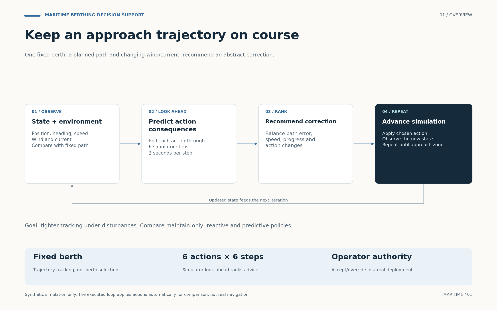
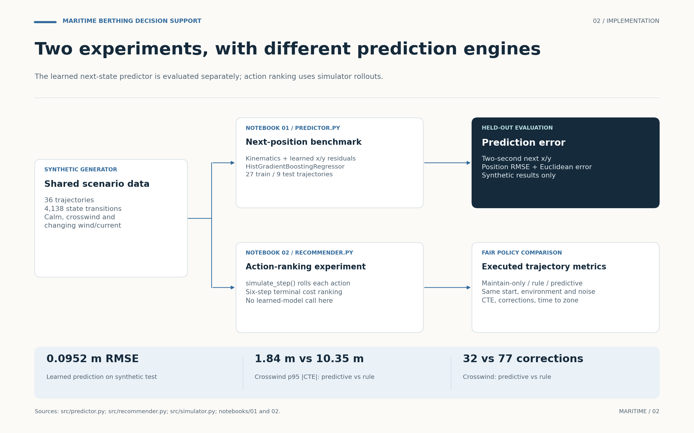
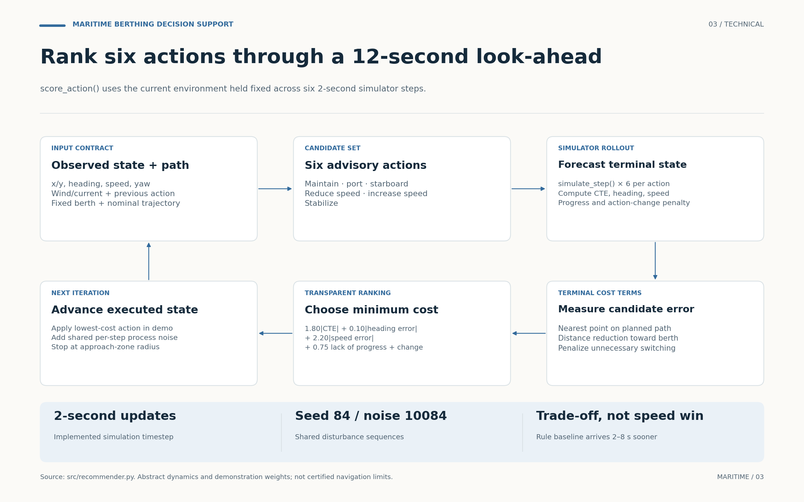

# Maritime Berthing Decision Support: visual walkthrough

The repository contains two related but distinct experiments: learned next-state prediction, and simulator-based look-ahead for advisory action ranking. The diagrams preserve that separation and show the executed feedback loop.

## 01 · Overview

One fixed berth, a planned path and changing wind/current; recommend an abstract correction.



[Editable SVG](../assets/workflows/01_overview.svg) · [PNG](../assets/workflows/01_overview.png)

## 02 · Implementation

The learned next-state predictor is evaluated separately; action ranking uses simulator rollouts.



[Editable SVG](../assets/workflows/02_implementation.svg) · [PNG](../assets/workflows/02_implementation.png)

## 03 · Technical

score_action() uses the current environment held fixed across six 2-second simulator steps.



[Editable SVG](../assets/workflows/03_technical.svg) · [PNG](../assets/workflows/03_technical.png)

## Implementation notes

- The learned model is MultiOutputRegressor(HistGradientBoostingRegressor), trained on residual x/y displacement beyond kinematics. It is not an LSTM.
- The learned predictor is evaluated on the last 9 of 36 complete trajectories, with the first 27 used for training. Synthetic held-out position RMSE is 0.0952 m; this is not real navigation accuracy.
- recommend_action() uses score_action(), which calls simulate_step() over six steps. The learned residual model is not called in action ranking or the executed closed-loop comparison.
- The look-ahead uses the current environment held fixed during each candidate rollout. It does not consume the future disturbance sequence; executed policies receive the same environment/noise sequence over their common time prefix.
- The crosswind p95 absolute cross-track error is 1.84 m for predictive look-ahead versus 10.35 m for the reactive rule baseline; non-MAINTAIN corrective steps are 32 versus 77. These values apply to that scenario, not all scenarios.
- The reactive policy reaches the approach zone 2–8 seconds sooner across the three scenarios and makes fewer corrections in calm conditions. The predictive policy is not universally faster or less intervention-heavy.
- The simulation applies the selected advisory action automatically to compare policies. Actual operator accept/override, audit logs, certified vessel control and production monitoring are not implemented. The stopping target is the approach zone, not completed physical docking.

## Source map

| Figure | Repository evidence | What was checked |
|---|---|---|
| Overview | src/recommender.py; src/simulator.py; README.md | Fixed berth; observe / roll out / rank / advance / repeat; comparison loop |
| Implementation | src/predictor.py; both notebooks; README.md closed-loop results | Separate learned predictor and simulator policy experiments; trajectory-level holdout; crosswind comparison |
| Technical | src/recommender.py: score_action, recommend_action, run_closed_loop | Six actions, six two-second steps, held-fixed current environment, terminal cost, shared process noise, approach-zone stopping |

The figures were grounded in repository commit [`279b8df483bc`](https://github.com/souhiab/maritime-berthing-decision-support/commit/279b8df483bcce37bdb8679ddc53e8f3856b6677). Source date: October 6, 2026. Figures are explanatory diagrams, not additional experiments.

## Files and regeneration

- `assets/workflows/`: three PNGs, three editable SVGs and one three-page PDF.
- `docs/workflow_figures.json`: labels, geometry, connections and evidence notes.
- `scripts/render_workflow_figures.py`: deterministic Matplotlib renderer using the existing project dependency.

From the repository root, run:

```bash
python scripts/render_workflow_figures.py
```

The script can also run from another directory using its absolute path. It only recreates the visual assets and does not execute or alter the research notebooks, data, models or reported metrics. Text-bound checks reject card overflow during rendering.

The shared visual language uses a warm background, dark navy decisions, project-specific accents and generous spacing. Solid connections show implemented data flow; dashed campaign-test elements mark proposed extensions. The SVG labels remain editable text.
